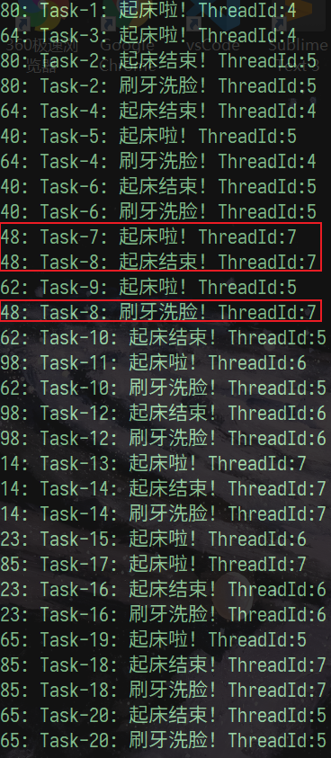
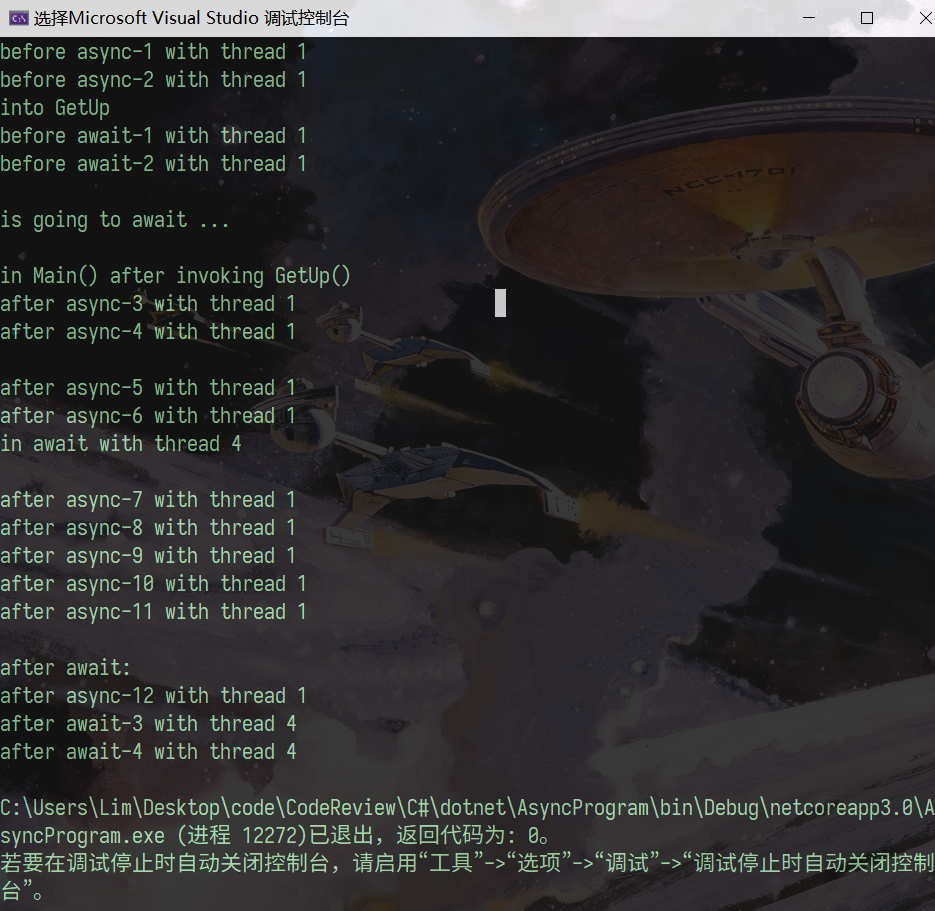
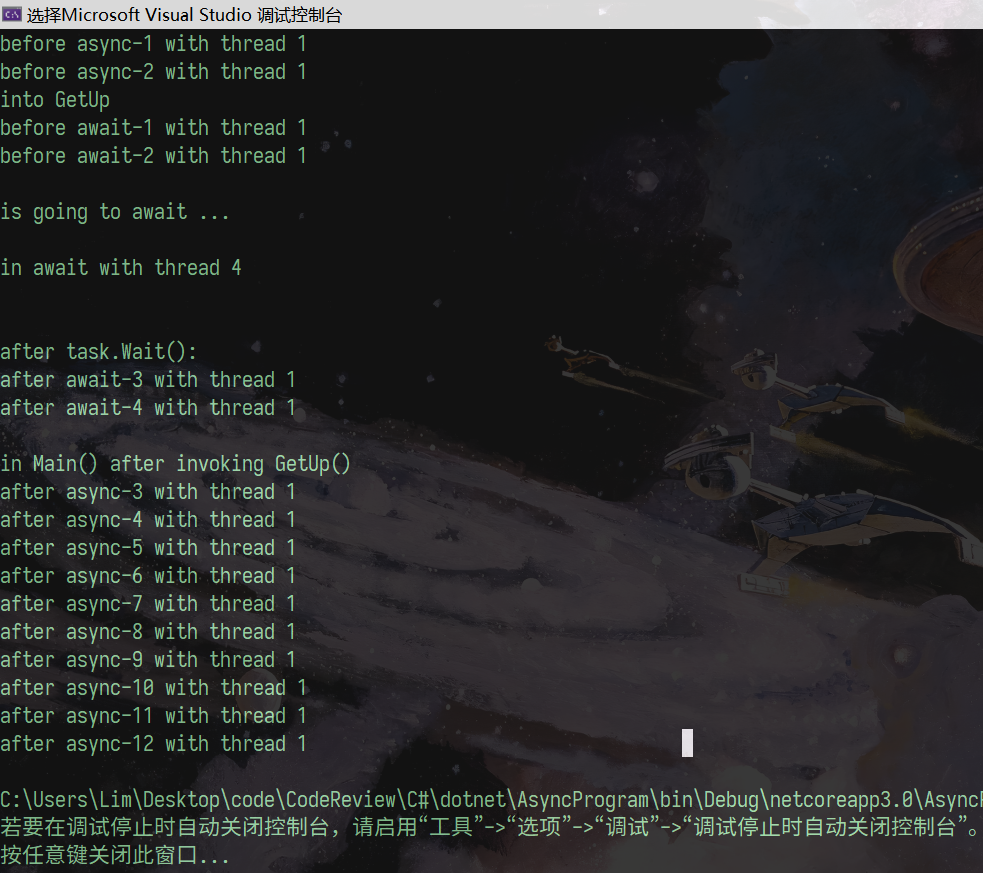

# C# 异步编程


### 1. 异步和并行-概念

- **First of All：不要把异步和多线程混为一谈**
    


- **异步：某个事件不等待另外一个事件完成就可以怎么怎么样**
  - **因为异步，所以时间上有交错，不同线程间在某一个时间点上会重合，而某时间点就会有先后执行**
- **同步：某个事件必须等待另外一个事件的完成才可以怎么怎么样**


#### 1.1 概念区别

- **并行（parallel）：多个任务真正的“同时”进行，只能在多核处理器上实现，即真正的多线程，因为一个CPU核心同一个时间点只能处理一个任务，所以并行只能在多（核）处理器上实现。并行是能够真正提高程序运行效率的**

- **并发（concurrency）：多个任务在运行时间上有重叠，通常在单核CPU中实现，在微观上来看CPU在同一时间片上还是只能处理一个任务，即串行**

  - 在电脑没有多核CPU的时代（或者程序没有运行在多核上），我们用并发（concurrency）来模拟并行。

    简单的说：

    - CPU的运行被分成很多的“时间片”（时间片非常的短，我们人类是察觉不到的）
    - 这个时间片里CPU可以执行A任务，下一个时间片里CPU就执行B任务，再下一个时间片C任务；然后再回来执行A，再执行B，再C；再A……如此往复
    - 在我们看来，A/B/C三个任务似乎被同时执行一样

- **多线程（multiple-threads）：一个进程上有多个线程同时运行。在某些语境下可以和“并发”混用，因为目前的操作系统是使用多线程实现并发**

- **进程（process）：重量级，是操作系统分配资源（例如内存/CPU/IO等资源）的单位，通常是一个运行中的程序**

  - 由操作系统管理（调度）
  - 一个应用程序至少有一个（可以有多个）进程
  - 资源包括：内存、CPU、I/O等
  - 进程之间的资源不能共享
  

- **线程（thread）：轻量级，共享进程资源**

  - 线程不具备独立完成一个任务的资源，它需要进程的支持
  - 多个线程可共享进程资源
  

- **为什么需要“假的”并行：并发？**

  - 增加响应（responsive），常用于UI
  - 多核CPU提高吞吐量（throughput）。主要是源于CPU（尤其是多核CPU）和I/O操作在效率上的巨大差距；如果只能同步串行（即同步单线程）的话，CPU将存在大量的“等待空闲”时间，不利于资源利用。

- **为什么需要？**

  无论是多进程，还是多线程，本质上都是为了让多个进程/线程同时（或者至少看起来像同时）完成一个工作，从而：

1. 压榨系统性能。简单理解，一桌菜10个人吃比1个人吃要快（*并发后文详述*）
2. 提高用户响应。操作系统多进程，所以我们可以一边听歌（一个进程）一边写代码（又一个进程）；射击游戏多线程，所以你跑你的，我打我的，不会你跑的时候我就不能开枪，我开枪的时候你就不能跑……（用WinForm 做坦克大战就这效果）

用于ASP.NET的IIS本身就是多线程的。


### 2. 异步和并行-线程代码

#### 2.1 Thread类

- **Task是在.NET 4.0之后引入的，之前.NET提供的是Thread（线程）类。**


##### 2.1.1 单线程

- **在此之前，我们的代码都是运行在一个线程中，这被称之为“单线程编程”**。
- **我们默认使用的这个线程被称为主（primary）线程，或者启动线程。使用Thread.CurrentThread可以获取：**

```c#
using System.Threading;
Thread current = Thread.CurrentThread;
```


##### 2.1.2 多线程

- **让代码运行在多个线程中，就被称之为“多线程编程”，又称之为并发。**
- **可以new一个工作线程：**

```c#
static void Main(){
    Thread current = new Thread(Process); 
    
	current.Start();
    
    // 然后，可以获取线程的相关信息：注意自行下列代码时有可能会因为子线程 current 的执行完毕而抛出异常，
    // 那么此时可以获取当前正在执行的线程来查看下列信息：Thread current = Thread.CurrentThread;
    Console.WriteLine(Thread.GetDomain().FriendlyName);
    Console.WriteLine(current.ManagedThreadId);     //托管线程Id
    Console.WriteLine(current.Priority);            //优先级
    Console.WriteLine(current.ThreadState);         //线程状态
    Console.WriteLine(current.IsThreadPoolThread);  //是否线程池线程
    
    // new出来的Thread需要调用Start()来启动。多线程会带来异步和并发的效果：
    for (int i = 0; i < 20; i++)
    {
        //Console.WriteLine($"{i}：ThreadId-{Thread.CurrentThread.ManagedThreadId}");
        new Thread(() =>
        {
            Console.WriteLine($"{i}：ThreadId-{Thread.CurrentThread.ManagedThreadId}");
        }).Start();
    }
    
}

public static void Process()
{
    Console.WriteLine($"ThreadId:{Thread.CurrentThread.ManagedThreadId}");
}
```

- **说明：**
  - 为什么是managed？操作系统控制“真正的”线程，C#开发人员通过.NET运行时控制操作系统上真正的线程，我们获取的是.NET运行时中的线程ID
  - 优先级：当出现多个线程进行资源争夺时，操作系统按其优先级从高到低进行分配
  - 线程状态：因为线程中的任务无法在一个CPU时钟周期内完成，当CPU被分配去处理其他线程时，当前线程也不能被“销毁”，只需要改变其状态即可
  - 线程池：后文详述


##### 2.1.3 前台线程和后台线程

- 上述线程（主线程和工作线程）都是**前台**（foreground）线程：主线程与通过 new Thread() 创建。

- 此外还有**后台**（background）线程：在线程池中维护。

- 前后台线程的区别：如果前台线程终止，后台线程也会被结束；反之不成立。

- 可以改变线程的前后台状态：

```cs
current.IsBackground = true;
```


- 控制台可以显示所有前台线程的输出，但后台线程就不一定了：

```cs
for (int i = 0; i < 10; i++)
{
    Thread thread = new Thread(() =>{
        Thread.Sleep(1);
        Console.WriteLine($"{i}：ThreadId-{Thread.CurrentThread.ManagedThreadId}");
       });
    thread.IsBackground = true;
    thread.Start();
    Console.WriteLine("main-thread, i =" + i);
}
```


- *演示：后台线程中的控制台输出无法呈现*

- 因为多个线程之间的协调调度是一件非常麻烦而且容易出错（error-prone）的，.NET已经不建议开发人员直接使用Thread，而是使用Task。所以很多线程方法也已经被 [Obsolete] 标记 了，表示已经被弃用，比如：Abort()、Suspend()、Resume()……


##### 2.1.4 线程池

1. 理解“池（pool）”的概念：

- 一个线程使用完成后并不销毁，而是放回池中
- 所以池中可以存放多个线程
- 下次使用时直接从池中取出未使用的线程


2. 一个进程只有一个线程池，池中的线程都是：

- 后台线程
- 使用默认的priority：即 normal 
- 使用相同的栈大小：1MB
- is in the multithreaded apartment（一个COM组件允许多个线程访问，COM组件内部具有同步线程的能力）
- 使用于“短期运行”的线程


3. 可以设置线程池中的最大/最小线程数


4. 线程池中线程的调度依赖于：

- TaskScheduler：.NET中一个专门负责线程池中线程的调度。

- 大体上来说，它利用以下一些方式提供其运行效率：
  - 使用队列，先进先出
  - 使用算法防止某些线程偷懒（work stealing）
  - 处理一些长运行（long-running）线程：会阻塞队列
  - Task inlining（任务内联）：当一个 Task 在等待的时候，它就可以在“等待”状态的线程上同步执行

- 绝大多数场景，我们使用.NET内置的调度就OK了。


### 3. Task

- **总体上来说，.NET 鼓励我们使用：基于任务（Task）的异步编程**

- **Task 可以理解为工作在未来某个时间一定会完成的承诺（promise）**

- **如果Task需要一个线程，默认它会利用线程池来获取。**
- **.NET 为我们提供了两种 Task：**
  - **Task：不返回值**
  - **Task<T>：返回一个 T 类型对象**

- **在.NET core的I/O类库中，我们会发现这样的方法：**

```c#
public static Task AppendAllLinesAsync(string path, IEnumerable<string> contents, Encoding encoding, CancellationToken cancellationToken = default); 

public static Task<byte[]> ReadAllBytesAsync(string path, CancellationToken cancellationToken = default);
```

注意：

- 方法名被添加了Async后缀（推荐命名规范）
- 方法的返回类型为Task或Task<T>
- Task在代码层面上讲，是一个实现了 IAsyncResult 的类，Task<T>继承了Task。
- 从逻辑层面上讲，Task是一份工作/任务，该工作/任务会被异步的执行，并未来某个时间完成。


1. **示例代码：**

```c#
using System;
using System.Threading;
using System.Threading.Tasks;

/**
 * @author zlim
 * @create 2020/7/29 15:41:45
 */
namespace AsyncProgram {
    public class TaskPractice {
        public static void Main(string[] args) {
            Action getUp = () => {
                Console.WriteLine($"Task:{Task.CurrentId}:起床啦！..."+
                    $"ThreadId:{Thread.CurrentThread.ManagedThreadId}");
                Console.WriteLine($"Task:{Task.CurrentId}:洗脸 ..." +
                    $"ThreadId:{Thread.CurrentThread.ManagedThreadId}");
            };

            for (int i = 0; i < 10; i++) {
                Console.WriteLine($"第{i + 1}次循环：");
                Task t1 = new Task(getUp);
                t1.Start();
                Console.WriteLine("t1 start ... ");

            }
            /*
            说明：
                因为 Task 是异步执行并且是基于线程池中线程的，因此在 Task 执行时会打乱时间顺序， 
                当一个 Task 拥有 CPU 的时间片是就会通过线程池中的一个线程执行，如果此时该 Task 失去了 CPU 的时间片，那么该 Task 就原地等待；
                当再次被分配到 CPU 的时间片时，该 Task 会按照上次执行到哪的顺序接着往下执行，
                而不是从头开始，并且接着往下执行时依然会通过上次线程池中的那个线程来执行；
                不同的 Task 执行，可能会有下个 Task 从线程池中分配到的线程是上个 Task 分配到的线程，这样是不影响的，
                因为 Task 是从线程池中拿线程，所以开发者是无法控制某一个 Task 分配到哪一个线程的。
                但是 Task 只要能分配到线程就表明此线程是可用的。
            */

        }
    }
}

```

- **说明：**
  - **因为 Task 是异步执行并且是基于线程池中线程的，因此在 Task 执行时会打乱时间顺序， 当一个 Task 拥有 CPU 的时间片是就会通过线程池中的一个线程执行，如果此时该 Task 失去了 CPU 的时间片，那么该 Task 就原地等待；当再次被分配到 CPU 的时间片时，该 Task 会按照上次执行到哪的顺序接着往下执行，而不是从头开始，并且接着往下执行时依然会通过上次线程池中的那个线程来执行；**
  - **不同的 Task 执行，可能会有下个 Task 从线程池中分配到的线程是上个 Task 分配到的线程，这样是不影响的，因为 Task 是从线程池中拿线程，所以开发者是无法控制某一个 Task 分配到哪一个线程的。但是 Task 只要能分配到线程就表明此线程是可用的。**
- **输出结果：**

  


#### 3.1 Action 和 Func

- Task要完成的任务由 Action 和 Func 体现：

- Task：使用Action，该Task没有返回 
- Task<T>：使用Func，该Task还要返回一个T类型对象

- 最直观的方式是将Action或Func作为Task的构造函数参数传入：

```c#
Action getup = () =>
{
    Console.WriteLine("getUp()……");
};
Task t1 = new Task(getup);
t1.Start();
```

或者：

```c#
Func<int> getup = () =>
{
    Console.WriteLine("getUp()……");
    return new Random().Next();
};
Task<int> t1 = new Task<int>(getup);
t1.Start();
```


- Action和Func都可以带一个object类型的传入参数，object的值在new Task()时传入：

```c#
Action<object> getup = (x) =>
{
    Console.WriteLine($"getUp({x})……");
};
Task t = new Task(getup, 23);
t.Start();
```


#### 3.2 新开一个 Task 并不总是新开一个 Thread

- **从逻辑上讲，Task是比线程“更高层的抽象”，它是对任务（work）的封装，而不是线程（thread）的封装**

- **从实现上讲，异步并不一定需要一个线程。是否开启一个新线程，是由scheduler决定的，developer 可以强制要求开启一个新的线程，但无法要求任务必须运行在当前线程，并且任务运行的时间也不无法要求，只可以肯定任务（Task）一定是会完成的。**

- **目前来说：**

- - I/O相关异步，是不开新线程的，异步由底层I/O实现
  - CPU相关的线程，会利用TaskSchedular从线程池获取

- **示例代码：**

- ```c#
  /// <summary>
  /// Task 之 Action 讲解
  /// </summary>
  /// <param name="args"></param>
  public static void Main0(string[] args) {
      Action getUp = () => {
          Console.WriteLine($"Task:{Task.CurrentId}:起床啦！..."+
                            $"ThreadId:{Thread.CurrentThread.ManagedThreadId}");
          Console.WriteLine($"Task:{Task.CurrentId}:洗脸 ..." +
                            $"ThreadId:{Thread.CurrentThread.ManagedThreadId}");
      };
  
      for (int i = 0; i < 10; i++) {
          Console.WriteLine($"第{i + 1}次循环：");
          // new 出来的 Task 需要显式调用 Start() 才开始运行
          // 但是好处是，可以在 t1.Start(); 之前写代码
          Task t1 = new Task(getUp);
          //Console.WriteLine("Before t1.Start() ... ");
          //Console.WriteLine("Before t1.Start() ... ");
          //t1.Start();
          Console.WriteLine("t1 start ... ");
  
          //Task t1 = Task.Run(getUp);// 更灵活
          // 不需要再调用 Start()，通过 Run 方法生成 Task 会自动运行，此时再调用 Start() 会抛出异常
          //t1.Start();
          // Unhandled exception. System.InvalidOperationException: 
          // Start may not be called on a task that was already started.
          //Console.WriteLine("Task.Run(getUp) ... ");
  
          //Task t1 = Task.Factory.StartNew(getUp);// 拥有众多重载
          //Console.WriteLine("Task.Factory.StartNew(getUp) ... ");
  
          //t1.Wait();// 确保 t1 任务完成：会一直等着当前任务执行完毕，
          //只有当当前任务执行完了才会继续往后执行程序中的代码
          //Console.WriteLine("t1.Wait() ... ");
  
          t1.RunSynchronously();
          // 对当前的 Task 同步运行 TaskScheduler：那么完全就没有异步运行的效果了
          Console.WriteLine("t1.RunSynchronously() ... ");
  
      }
  ```

- **输出结果：**

  - ```c#
    通过 new Task 输出结果为：
                    第1次循环：
                    t1 start ...
                    第2次循环：
                    t1 start ...
                    第3次循环：
                    t1 start ...
                    第4次循环：
                    t1 start ...
                    第5次循环：
                    t1 start ...
                    第6次循环：
                    t1 start ...
                    第7次循环：
                    t1 start ...
                    第8次循环：
                    t1 start ...
                    第9次循环：
                    t1 start ...
                    第10次循环：
                    Task:3:起床啦！...ThreadId:6
                    Task:4:起床啦！...ThreadId:4
                    Task:4:洗脸 ...ThreadId:4
                    Task:2:起床啦！...ThreadId:7
                    Task:2:洗脸 ...ThreadId:7
                    Task:6:起床啦！...ThreadId:7
                    Task:1:起床啦！...ThreadId:5
                    Task:5:起床啦！...ThreadId:4
                    Task:5:洗脸 ...ThreadId:4
                    Task:7:起床啦！...ThreadId:4
                    Task:7:洗脸 ...ThreadId:4
                    Task:8:起床啦！...ThreadId:4
                    t1 start ...
                    Task:3:洗脸 ...ThreadId:6
                    Task:6:洗脸 ...ThreadId:7
                    Task:10:起床啦！...ThreadId:7
    ```

- **说明：**

  1. **因为 Task 是异步执行并且是基于线程池中线程的，因此在 Task 执行时会打乱时间顺序， 当一个 Task 拥有 CPU 的时间片是就会通过线程池中的一个线程执行，如果此时该 Task 失去了 CPU 的时间片，那么该 Task 就原地等待；当再次被分配到 CPU 的时间片时，该 Task 会按照上次执行到哪的顺序接着往下执行，而不是从头开始，并且接着往下执行时依然会通过上次线程池中的那个线程来执行；**           

  2. **不同的 Task 执行，可能会有下个 Task 从线程池中分配到的线程是上个 Task 分配到的线程，这样是不影响的，因为 Task 是从线程池中拿线程，所以开发者是无法控制某一个 Task 分配到哪一个线程的。但是 Task 只要能分配到线程就表明此线程是可用的。**


- **推荐顺序：==Task.Run() =>Task.Factory.StartNew() =>new Task()==**

- **理解区别：**
  - ==t1.Wait();== ：保证只有在当前任务执行完时才执行其他的代码，而其他代码的执行可以是异步的
  - ==t1.RunSynchronously();== ：保证当前代码同步执行，不管是 Task（任务）中的代码还是主线程中的代码


#### 3.3 向 Task<T> 传递参数

1. **方式一：直接使用外部变量，也通过闭包的方式：**

- **示例代码：这样做的问题是，由于异步调用，i 值会 ==“飘忽不定”== **

- ```c#
  public static void Main(){
      //for (int i = 0; i < 10; i++) {
  	// 可能会出现主线程中的代码运行的 {i + 1} 的结果与 Task 任务中运行的 {i + 1} 的结果不一样
      // 原因是：主线程上的 i 进行了 i++ 自增操作，但还没来得及进行 i < 10 比较时，就被 for 循环中执行任务所分配的子线程拿到的
      // 那么此时在任务中再进行 {i + 1} 计算就可能会发生打印出 （第11次）的结果：这其实就是并发下的线程不安全问题
      //    Console.WriteLine($"第{i + 1}次");
  
      //    Task<long> t1 = new Task<long>( () => {
      //        Console.WriteLine($"（第{i+1}次）Task-{Task.CurrentId}：起床啦！~"+
      //                          $"ThreadId is {Thread.CurrentThread.ManagedThreadId}");
      //        return DateTime.Now.Ticks;
      //    });
  
      //    t1.Start();
  
      //    Show(t1);
  
      //}
  
      // 通过 while 循环来看：
      int i = 0;
      while (i < 10) {
          Console.WriteLine($"第{i}次：");
  
          Task<long> t1 = new Task<long>(() => {
              Thread.Sleep(1);// 延长任务的执行时间，让它有机会在 i++ 语句后面执行 Task 中的代码
              Console.WriteLine($"（第{i}次）Task-{Task.CurrentId}：起床啦！~" +
                                $"ThreadId is {Thread.CurrentThread.ManagedThreadId}");
              return DateTime.Now.Ticks;
          });
  
          t1.Start();
  
          Show(t1);
  
          Console.WriteLine("helloworld!");
          Console.WriteLine("helloworld!");
  
          i++;
          Console.WriteLine($"{i}++");
      }
  }
  
  public static void Show(Task task) {
      Console.WriteLine($"Task-{task.Id}.Start() ... " + 
                        $"task.status is {task.Status}," +
                        $"task.IsCompleted is {task.IsCompleted}," +
                        /* $"task.AsyncState is {task.AsyncState},"+*/
                        $"ThreadId is {Thread.CurrentThread.ManagedThreadId}");
      // 只要不是在子线程（Thread）或者任务（Task）中执行的代码那么就会在主线程中执行
      // ThreadId is 1:只要是在主线程的代码那么其 ManagedThreadId 就是1
  }
  ```

- **输出结果：**
   
  

  

- **说明：**

  - 如果是同步执行的代码，那执行完 Console.WriteLine($"{i}++"); 语句后会按照程序语句逻辑顺序返回去执行 while(i < 10) 判断，此时判断为 false 于是就会跳出 while 循环；
  - 但是由于 Task 是基于异步多线程执行的，那么 Task 中代码的执行就可以不用等待 while(i < 10) 语句的判断就执行其代码，因此就有可能 Task 中的代码会在 i++ 语句后面执行；那么此时 


2. **方式二：在 new Task<long>() 传入一个参数：==推荐使用==**

   - **示例代码：可以保证每次 Tas 收到恒定的传入值 **

   - **说明：此种方式就相当于形参与实参，形参是对实参的一个拷贝，因此不会出现 ==第10次== 的输出结果**

   - ```c#
     public static void Main(){
         for (int i = 0; i < 10; i++) {
             Task<long> t1 = new Task<long>( (n) => {
                 Console.WriteLine($"Task:{Task.CurrentId}:起床啦！..." +
                                   $"ThreadId:{Thread.CurrentThread.ManagedThreadId}");
                 return DateTime.Now.Ticks;
             },i);
             t1.Start();
     
             Show(t1);
         }
     }
     
     public static void Show(Task task) {
         Console.WriteLine($"Task-{task.Id}.Start() ... " + 
                           $"task.status is {task.Status}," +
                           $"task.IsCompleted is {task.IsCompleted}," +
                           /* $"task.AsyncState is {task.AsyncState},"+*/
                           $"ThreadId is {Thread.CurrentThread.ManagedThreadId}");
         // 只要不是在子线程（Thread）或者任务（Task）中执行的代码那么就会在主线程中执行
         // ThreadId is 1:只要是在主线程的代码那么其 ManagedThreadId 就是1
     }
     ```

   - **输出结果：**
   - 


#### 3.4 ContinueWith

- **确保一个线程在之前线程完成之后再开始运行**

- **ContinueWith() 会返回一个新的 Task，该 Task 处于 ==WaitingForActivation== 状态，并且会在之前 Task 完成后自动运行**

  - **示例代码：**

  - ```c#
    public static void Main(string[] args) {
        for (int i = 0; i < 10; i++) {
            Task<int> getUpTask = Task<int>.Run( () => {
                int seed = new Random().Next(100);
                Console.WriteLine($"{seed}: Task-{Task.CurrentId}: 起床啦！"+
                                  $"ThreadId:{Thread.CurrentThread.ManagedThreadId}");
                return seed;
            });
    
            // Task Task<int>.ContinueWith(Action<Task<int>,object?> continuationAction,object? state);
            // 创建一个传递有状态信息并在目标 Task<TResult> 完成时执行的延续
            // 确保了不同 Task 之间的运行顺序，也即保证了在 getUpTask 运行完之后再运行 ContinueWith 中的那个 Task
            getUpTask.ContinueWith( (x) => {
                Console.WriteLine(x == getUpTask);
                Console.WriteLine($"{x.Result}: Task-{Task.CurrentId}: 起床结束！" 				+$"ThreadId:{Thread.CurrentThread.ManagedThreadId}");
                Console.WriteLine($"{x.Result}: Task-{Task.CurrentId}: 刷牙洗脸！" 				+ $"ThreadId:{Thread.CurrentThread.ManagedThreadId}");
            });
        }
    }
    ```

  - **输出结果：**
  


- **使用 task.Wait() **

  - ```c#
    public static void Main(){
        for (int i = 0; i < 10; i++) {
            Task<int> getUpTask = Task<int>.Run(() => {
                int seed = new Random().Next(100);
                Console.WriteLine($"{seed}: Task-{Task.CurrentId}: 起床啦！" +
                                  $"ThreadId:{Thread.CurrentThread.ManagedThreadId}");
                return seed;
            });
    
            getUpTask.Wait();
    
            Task task = Task.Run( () => {
                // 因为这里没有传入参数，我们只能通过 Task.Result 来获得上个任务的返回值
                // 并且调用 Task.Result 属性会让此任务等待 Task 任务完成再执行
                Console.WriteLine($"{getUpTask.Result}: Task-{Task.CurrentId}: 起床结束！" +
                                  $"ThreadId:{Thread.CurrentThread.ManagedThreadId}");
                Console.WriteLine($"{getUpTask.Result}: Task-{Task.CurrentId}: 刷牙洗脸！" +
                                  $"ThreadId:{Thread.CurrentThread.ManagedThreadId}");
            });
    
        }
    }
    ```

  - **输出结果：**

    

- **两者之间的区别：**

1. **Wait() 阻塞当前线程进行等待，直到 Wait() 调用的那个任务执行完毕，而 ContinueWith() 则是不会阻塞当前线程进行等待**

2. **Wait 是确保上面一个当前 Task 全部完成后，后续的任务的执行可以是新的线程进行的**

3. **ContinueWith 是一个线程完成了一个任务后再去执行其他的任务**


- **仅使用 Task.Result**

  - 示例代码：

  - ```c#
    public static void Main(){
        Task<DateTime> getUp = Task<DateTime>.Run(() => {
            //Thread.Sleep(10);
            Console.WriteLine($"ThreadId:{Thread.CurrentThread.ManagedThreadId}" +
                              $"Task-{Task.CurrentId}:起床啦！！！");
            return DateTime.Now;
        });
    
        Task.Run(() => {
            Console.WriteLine($"ThreadId:{Thread.CurrentThread.ManagedThreadId}" +
                              $"Task-{Task.CurrentId}:起床结束！！！");
            Console.WriteLine($"ThreadId:{Thread.CurrentThread.ManagedThreadId}" +
                              $"Task-{Task.CurrentId}:刷牙洗脸 ... ");
            Console.WriteLine($"ThreadId:{Thread.CurrentThread.ManagedThreadId}" +
                              $"Task-{Task.CurrentId}:{getUp.Result}");// Task.Result 会阻塞线程
        });
    }
    ```

  - **输出结果：**
    

  - **说明：**
    
    - 观察程序输出结果，这两个 Task 是异步并行的关系，两者都不需要等待另外一方运行完成再执行；但是第二个 Task 中的最后一条语句，使用了别的 Task 的返回值，也即 Task.Result 属性，那么它就会等到前一个任务执行完成再执行，也即在程序输出结果中输出的时间那一行永远不可能出现在 起床啦！！！ 语句前面


#### 3.5 异常处理

- **多线程中一个线程是无法捕获另外一个线程中发生的异常的，也即主线程是无法捕获子线程的异常的，除非碰到了 ==Task.Wait()== 方法：**
  - 多个线程中的所有的异常被包裹在 ==AggregateException== 中
  - 可以通过使用 AggregateException 异常实例中的：
    
  - InnerException 依次获取所有线程上的异常，以及 Handle() 方法处理异常
    
  - **示例代码：**
  
  - ```c#
    /// <summary>
    /// 多线程中的异常处理
    /// </summary>
    /// <param name="args"></param>
    public static void Main(string[] args) {
        Task<DateTime> getUp = Task<DateTime>.Run(() => {
            throw new Exception("ouuried a exception ... ");
            Thread.Sleep(10);
            Console.WriteLine($"ThreadId:{Thread.CurrentThread.ManagedThreadId}" +
                              $"Task-{Task.CurrentId}:起床啦！！！");
            return DateTime.Now;
        });
    
        //多线程中一个线程是无法捕获另外一个线程中发生的异常的，也即主线程是无法捕获子线程的异常的，除非碰到了 == Task.Wait() == 方法
        getUp.Wait();
        // Unhandled exception. System.AggregateException: One or more errors occurred. (ouuried a exception ... )
    
    }
    ```
  
    

1. **通过 InnerExceptions 处理：**

   ```c#
   /// <summary>
   /// 多个 Task 异常处理之 catch
   /// </summary>
   /// <param name="args"></param>
   public static void Main(){
       Task[] getUps = new Task[10];
       for (int i = 0; i < 10; i++) {
           Thread.Sleep(100);
           getUps[i] = Task.Run(() => {
               throw new Exception(i.ToString());
           });
       }
   
       try {
           // void Task.WaitAll(params Task[] tasks) ：等到提供的所有 Task 对象完成执行过程
           Task.WaitAll(getUps);
       } catch (AggregateException ae) {
           foreach (var item in ae.InnerExceptions) {
               Console.WriteLine(item.Message);// 这里的打印结果不保证是按顺序输出1到10，因为 Task 是异步执行的
           }
       }
   }
   ```

   - **输出结果：有多种可能，是不可控的，因为 Task 的异步执行的**
   


2. **使用 Handle 处理：**

   ```c#
   /// <summary>
   /// 多个 Task 异常处理之 catch
   /// </summary>
   /// <param name="args"></param>
   public static void Main(){
   	Task[] getUps = new Task[10];
       for (int i = 0; i < 10; i++) {
           Thread.Sleep(1);
           getUps[i] = Task.Run(() => {
               throw new Exception(i.ToString());
           });
       }
   
       try {
           Task.WaitAll(getUps);
       } catch (AggregateException ae) {
           // void AggregateException.Handle(Func<Exception,bool> predicate)
           // 在每个由此 AggregateException 包含的 Exception 上调用处理程序
           // Handle 的参数接收的是带 Exception 参数返回值为 bool 类型的方法
           // 并且返回 true 则不处理 Task 中的异常，返回 false 则表示处理异常
           // Handle 处理的是 InnerExceptions 中的异常，因此这里的 x 其实就是 InnerExceptions
           ae.Handle(x => {
               Console.WriteLine(x.Message);
               //return (x as AggregateException) == null;
               //return (x is AggregateException);
               return true;
           });
       }
   }
   ```

   

3. **此外，也可以直接使用：**

   ```c#
   /// <summary>
   /// Task 异常属性
   /// </summary>
   /// <param name="args"></param>
   public static void Main(){
   	Task getup = Task<int>.Run(() => {
           Console.WriteLine($"at await in GetUp() with thread {Thread.CurrentThread.ManagedThreadId}");
   
           if (DateTime.Now.Ticks % 2 == 0) {
               throw new LCEexception();
           } else {
               throw new NotImplementedException();
           }
       });
   
       while (!getup.IsCompleted) { // 异常只会在 Task 完成之后被收集
           Console.WriteLine(getup.Status);
       }
   
       if (getup.IsFaulted) {
           foreach (var e in getup.Exception.InnerExceptions) {
               if (e is LCEexception) {
                   Console.WriteLine((e as LCEexception).Name);
               } else if (e is NotImplementedException) {
                   Console.WriteLine("Not Implement.");
               } else {
                   Console.WriteLine(e.Message);
               }
           }
       }
   }
   ```

   - 使用注意事项：

     - throw：
       - 异常会带来较大的资源开销（性能损耗），所以要尽可能避免异常被抛出（不是不写 throw exception 的代码）
       - 不要使用 Exception 作为分支判断条件
       - 尽可能的使用具体的、.NET 现有的异常
     - try ... catch：
       - 不知道怎么处理的，就不要处理
       - 不要 catch 之后，什么都不做（或者就包裹一下），直接 throw
       - 是在程序入口（顶层方法）处 catch 未捕获的异常（看情况）
     - finally：
       -  如果仅仅是为了释放资源，推荐使用 using 代码块
       -  使用 using 时注意和 try-catch 的搭配

     

#### 3.5 终止某个任务

- **只需要按部就班的书写如下代码即可：**

  - ```c#
    /// <summary>
    /// Task 的取消
    /// </summary>
    /// <param name="args"></param>
    public static void Main(string[] args) {
        // System.Threading.CancellationTokenSource:通知 CancelationToken，告知其应被取消
        CancellationTokenSource source = new CancellationTokenSource();
        // readonly struct System.Threading.CancellationToken：传播有关应取消操作的通知
        CancellationToken token = source.Token;
    
        Task<DateTime> getup = Task<DateTime>.Run( () => {
            // void CancellationToken.ThrowIfCancellationRequest()：如果已请求取消此标记，则引发 OperationCanceledException
            token.ThrowIfCancellationRequested();// 如果 Task 被 Cancel()，则会抛出异常
            Console.WriteLine($"Task-{Task.CurrentId}:起床啦！！"+
                              $"ThreadId:{Thread.CurrentThread.ManagedThreadId}");
            return DateTime.Now;
        },token);// 传入 token 指令，确保 Cancel 通知能被侦听
    
        // void CancellationTokenSource.Cancel()：传达取消请求
        source.Cancel();// 使用 source 进行 Cancel
    
        try {
            getup.Wait();// 只有在 Wait() 时才能捕获异常
        } catch (AggregateException ae) {
            // 使用 Handle() 方法进行处理
            ae.Handle( ie => {
                Console.WriteLine("Canceled?");
                return true;// 表示已经成功处理，不需要再抛出异常；return false 则会抛出异常
            });
        }
    }
    
    [Serializable]
    internal class LCEexception : Exception {
    
        public string Name { get; } = "zlim";
    
        public LCEexception() {
        }
    
        public LCEexception(string message) : base(message) {
        }
    
        public LCEexception(string message, Exception innerException) : base(message, innerException) {
        }
    
        protected LCEexception(SerializationInfo info, StreamingContext context) : base(info, context) {
        }
    }
    ```

  - **除了在 Task 内部使用 token.ThrowIfCancellationRequested(); 抛出异常，还可以使用：**

    - ```c#
      Task<DateTime> getup = Task<DateTime>.Run( () => {
      	token.Register( () => { Console.WriteLine("registered cancel handle");});
      
          Console.WriteLine($"Task-{Task.CurrentId}:起床啦！！"+
                            $"ThreadId:{Thread.CurrentThread.ManagedThreadId}");
          return DateTime.Now;
      },token);// 传入 token 指令，确保 Cancel 通知能被侦听
      
      // 并且需要在 Cancel() 方法之前加上
      Thread.Sleep(1);
      source.Cancel();// 使用 source 进行 Cancel
      ```


### 4. 异步方法

- **实现：在方法声明时加上 ==async==，在方法内部使用 ==await== **

- **被 async 标记的方法被称为异步方法，async 和 await 必须成对出现，不然会：**
- 报警告：只有 async 没有 await 
  - 报编译错误：只有 await 没有 async
  

#### 4.1 异步方法的分类

- **异步方法分为两种：**

  **1. ==返回 void 或 Task==：异步方法一直同步运行，直到遇到 await 关键字：**

  ```c#
  /// <summary>
  /// 异步方法
  /// </summary>
  /// <param name="args"></param>
  public static void Main(string[] args) {
      Console.WriteLine($"before async-1 with thread {Thread.CurrentThread.ManagedThreadId}");
      Console.WriteLine($"before async-2 with thread {Thread.CurrentThread.ManagedThreadId}");
  
      GetUp();
      Console.WriteLine();
      Console.WriteLine("in Main() after invoking GetUp()");
      for (int i = 0; i < 10; i++) {
          // GetUp() 里 await部分的运行，会打乱这里代码的同步运行，也即 GetUp() 里 await部分中的代码会与 for 循环中的代码异步运行
          Console.WriteLine($"after async-{3 + i} with thread {Thread.CurrentThread.ManagedThreadId}");
      }
  }
  
  public static async void GetUp() {
      Console.WriteLine("into GetUp");
      Console.WriteLine($"before await-1 with thread {Thread.CurrentThread.ManagedThreadId}");
      Console.WriteLine($"before await-2 with thread {Thread.CurrentThread.ManagedThreadId}");
      // await 之间的代码，在主线程上运行
  
      Console.WriteLine();
      Console.WriteLine("is going to await ... ");
      // await 开始异步运行，方法运行到这时会从这里开始返回方法调用者处执行代码
      await Task.Run(() => {
          Console.WriteLine();
          Console.WriteLine($"in await with thread {Thread.CurrentThread.ManagedThreadId}");
          Console.WriteLine();
      });
  
      Console.WriteLine();
      Console.WriteLine("after await:");
      // 直到 await 中内容执行完毕，才开始（但不是立即或同步）执行 await 之后的代码
      Console.WriteLine($"after await-3 with thread {Thread.CurrentThread.ManagedThreadId}");
      Console.WriteLine($"after await-4 with thread {Thread.CurrentThread.ManagedThreadId}");
  }
  ```

  - **输出结果：**
    

  - **说明：**
    - 从 await 开始，代码开始分叉：也即开始异步执行，但不一定是新开线程：
    - 一边执行 await 后的表达式（Task）
    - 一边返回到方法调用者处继续执行

  - **实质上，await 采用的是 Task 的 ContinueWith() 机制：await 之后的方法内的代码，被 await Task 执行完毕后调用**
    - 非异步方法：只有 Task 异步执行
    - 调用 Wait() 的非异步方法：Wait() 会阻塞当前线程进行等待
  - **异步方法中的 void 可以被直接替换成 Task（推荐），以便于该方法进一步被 await 传递**
    - void 通常作为顶级（top-level）方法使用

  

  - **调用 Wait() 的非异步方法：**

    - **await 与 task.wait() 的区别：**

    - **如果是 wait() 那么 Task 后的语句是运行在主线程中的，并且 Task 后的语句会跟着 Task 后面执行，也即不会与 Main 方法中调用 GetUpWait 方法后的语句形成异步执行的关系**

    - 示例代码：

      ```C#
      public static void Main(string[] args) {
          Console.WriteLine($"before async-1 with thread {Thread.CurrentThread.ManagedThreadId}");
          Console.WriteLine($"before async-2 with thread {Thread.CurrentThread.ManagedThreadId}");
      
          //GetUp();
          GetUpWait();
          Console.WriteLine();
          Console.WriteLine("in Main() after invoking GetUp()");
          for (int i = 0; i < 10; i++) {
              // GetUp() 里 await部分的运行，会打乱这里代码的同步运行，
              // 也即 GetUp() 里 await部分中的代码会与 for 循环中的代码异步运行
              Console.WriteLine($"after async-{3 + i} with thread {Thread.CurrentThread.ManagedThreadId}");
          }
      }
      
      //如果是 wait 那么 Task 后面的语句是运行在主线程中的，并且 Task 后面的语句会跟着 Task 执行
      public static void GetUpWait() {
          Console.WriteLine("into GetUp");
          Console.WriteLine($"before await-1 with thread {Thread.CurrentThread.ManagedThreadId}");
          Console.WriteLine($"before await-2 with thread {Thread.CurrentThread.ManagedThreadId}");
      
          Console.WriteLine();
          Console.WriteLine("is going to await ... ");
          Task task =  Task.Run(() => {
              Console.WriteLine();
              Console.WriteLine($"in await with thread {Thread.CurrentThread.ManagedThreadId}");
              Console.WriteLine();
          });
          task.Wait();
      
          Console.WriteLine();
          Console.WriteLine("after task.Wait():");
          Console.WriteLine($"after await-3 with thread {Thread.CurrentThread.ManagedThreadId}");
          Console.WriteLine($"after await-4 with thread {Thread.CurrentThread.ManagedThreadId}");
      }
      ```
  
    - **输出结果：**
      
    
      
  
  2. **==返回 Task<T>==**
  
     - **返回值被 Task 包裹，写成 Task<T>，T 指方法体内声明返回的类型**
  
     - **示例代码：**
  
     - ```c#
       public static async Task<int> Get() {
       
           int x = await Task<int>.Run(() => {
               Console.WriteLine($"in await with thread {Thread.CurrentThread.ManagedThreadId}");
               return new Random().Next();
           });
       
           x = x > 100 ? 100 : x;
       
           Console.WriteLine($"after await-3 with thread {Thread.CurrentThread.ManagedThreadId}");
           Console.WriteLine($"after await-4 with thread {Thread.CurrentThread.ManagedThreadId}");
       	// 方法体内，返回的是 int
           return x;
       }
       ```
  
     - **调试需要技巧：**
  
     - ```c#
       public static void Main(string[] args) {
           Wrap();
       
           for (int i = 0; i < 10; i++) {
               Console.WriteLine($"after async-{3 + i} with thread {Thread.CurrentThread.ManagedThreadId}");
           }
       }
       
       public static async void Wrap() {
           // 不能直接使用 await 获取 Get() 的值，而是调用它，让它先跑起来
           Task<int> task = Get();
       
           // 运行 Get()，碰到里面的 await 后，控制权返回到这里
           // 于是 Get() 中的 Task 与以下语句开始异步执行（节省就节省在这一点）
           Console.WriteLine($"after invoke Get() with thread {Thread.CurrentThread.ManagedThreadId}");
           Console.WriteLine($"do something ... with thread {Thread.CurrentThread.ManagedThreadId}");
       
           // int y = task.Result;    // 阻塞当前线程进行等待：也即只能往下走
           // 但是 await 的话往下往上走都可以，因为它是异步执行的
       
           // 直到 await 调用 Get() 取值
           // 如果 Get() 已经执行完毕,则马上取值;否则还得再把控制权往上抛
           int x = await task;     // 不阻塞当前线程，当前线程和 Task 并发/异步运行：即会到主线程调用 Wrap 方法后面的代码继续走
           // 如果是同步运行则会继续执行下面的代码，但是 await 是异步运行的
       	
           // 只有上述 await task 中的 task 执行完毕后，才会执行异步方法 Wrap 中剩下的内容，也即下列代码：
           Thread.Sleep(50);
           Console.WriteLine($"after Thread-{Thread.CurrentThread.ManagedThreadId}.Sleep(50) ... ");
           Console.WriteLine("in Wrap():" + x + "with thread {Thread.CurrentThread.ManagedThreadId}");
       }
       ```
  
     - **特别注意：不能直接 int x = Get().Result 或者 int x = await Get() 取值**


### 5 **任务并行库（Task Parallel Library）**

- .NET 中 System.Threading 和 System.Threading.Tasks 名称空间下的类库
- 简化异步/并行开发，在底层实现：
  - 动态调整并行规模
  - 处理分区
  - 线程（池）调用（器）等

#### 5.1 基于 Task 的并行

- **最简单的例子，Parallel.Invoke() ： **

  - ```c#
    /// 基于 Task 的并行
    /// </summary>
    /// <param name="args"></param>
    public static void Main(string[] args) {
    	for (int i = 0; i < 5; i++) {
            // class System.Threading.Tasks.Parallel:提供对并行循环的和区域的支持
            // void Parallel.Invoke(params Action[] actions)：尽可能并行执行提供的每个操作
            Parallel.Invoke( () => {
                Console.WriteLine(i);
                Console.WriteLine($"task-{Task.CurrentId} begin:");
                Console.WriteLine($"task-{Task.CurrentId} in thread-{Thread.CurrentThread.ManagedThreadId}");
                Console.WriteLine($"task-{Task.CurrentId} end.");
            },() => {
                Console.WriteLine(i);
                Console.WriteLine($"task-{Task.CurrentId} begin:");
                Console.WriteLine($"task-{Task.CurrentId} in thread-{Thread.CurrentThread.ManagedThreadId}");
                Console.WriteLine($"task-{Task.CurrentId} end.");
            });
        }
        
    }
        /*
        输出结果：并不是10个任务就开了10的线程，但是2个任务循环5次就有10个任务：这10个任务的执行时完全并行的，类似于一条马路中划分出了多条道路，不同任务之间是并行执行的，但是同一任务中是按照代码的编写顺序执行的，也即多条道路一起执行，但是每条道路中是按顺序一辆车一辆车的走
                    0
                    0
                    task-1 begin:
                    task-2 begin:
                    task-1 in thread-4
                    task-2 in thread-1
                    task-1 end.
                    task-2 end.
                    1
                    1
                    task-4 begin:
                    task-3 begin:
                    task-4 in thread-1
                    task-3 in thread-4
                    task-3 end.
                    task-4 end.
                    2
                    task-6 begin:
                    task-6 in thread-1
                    task-6 end.
                    2
                    task-5 begin:
                    task-5 in thread-5
                    task-5 end.
                    3
                    task-8 begin:
                    task-8 in thread-1
                    task-8 end.
                    3
                    task-7 begin:
                    task-7 in thread-5
                    task-7 end.
                    4
                    4
                    task-10 begin:
                    task-10 in thread-1
                    task-10 end.
                    task-9 begin:
                    task-9 in thread-5
                    task-9 end.
    	*/
    
    ```

  - Parallel 的其他方法

    - For 循环

      - ```c#
        Parallel.For(0, 10, x => Console.WriteLine(x));
        ```

    - ForEach 循环

      - ```c#
        Parallel.ForEach(Enumerable.Range(1, 10), x => Console.WriteLine(x));
        ```

- **引入线程数组：Task[]**

  - WaitAll / WaitAny

    - ```c#
      void Task.WaitAll(params Task[] tasks):等待提供的所有 Task 对象完成执行过程
      int Task.WaitAny(params Task[] tasks):等待提供的任一 Task 对象完成执行过程
      ```

    

  - WhenAll / WhenAny

    - ```c#
      （可等待）Task Task.WhenAll(System.Collections.Generic.IEnumerable<Task> tasks):
      创建一个任务，该任务将在可枚举集合中的所有 Task 对象都已完成时完成
      使用情况：
      	await WhenAll(...);
      （可等待）Task<Task> Task.WhenAny(System.Collections.Generic.IEnumerable<Task> tasks):
      任何提供的任务已完成时，创建将完成的任务
      使用情况：
      	Task x = await WhenAny(...);
      ```

    

- **对比下面代码，体会 await 的 continuation：**

  - ```c#
    /// <summary>
    /// 引入线程数组：Task[]
    /// </summary>
    /// <param name="args"></param>
    public static void Main(string[] args) {
        GetUpTasks().Wait();
    }
    
    public static async Task GetUpTasks() {
        //await Task.Run(() => Console.WriteLine("洗脸"));
        //await Task.Run(() => Console.WriteLine("刷牙"));
        //await Task.Run(() => Console.WriteLine("吃早餐"));
        //await Task.Run(() => Console.WriteLine("背单词"));
    
        Task[] tasks = {
            Task.Run( () => Console.WriteLine("洗脸")),
            Task.Run( () => Console.WriteLine("刷牙")),
            Task.Run( () => Console.WriteLine("吃早餐")),
            Task.Run( () => Console.WriteLine("背单词")),
        };
        //（可等待）Task Task.WhenAll(System.Collections.Generic.IEnumerable < Task > tasks):
        //创建一个任务，该任务将在可枚举集合中的所有 Task 对象都已完成时完成
        //使用情况：await WhenAll(...);
        await Task.WhenAll(tasks);
        /*
                执行效果是无序的：并发执行
                    背单词
                    洗脸
                    刷牙
                    吃早餐
                */
    }
    ```


#### 5.2 并行 Linq：Parallel LINQ（PLINQ）


### 6. 最佳实践

- **使用异步/并行的副作用（side effect）：**
  1. 增加代码的复杂性（尤其是 bug 调试时）
  2. 异步/并行的切换需要消耗额外的资源
- **简单理解：**
  - 锁、死锁（DeadLock）、资源争夺（race condition）
  - 线程安全（Thread Safty）
  - 天下没有免费的午餐
- **总是在最后再考虑异步/并行：（尤其是 B/S 架构：因为 B/S 架构天生就是多线程的）**
  - 确定性能瓶颈
  - 确定该瓶颈可以通过异步/并行的方法解决
- **考虑开销（代码复杂性和额外调度）和收益**


